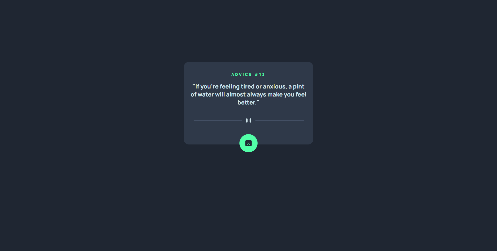

# Frontend Mentor - Advice generator app solution

This is a solution to the [Advice generator app challenge on Frontend Mentor](https://www.frontendmentor.io/solutions/advice-generator-react-ufeYxSI7i).

## Table of contents

- [Overview](#overview)
  - [The Challenge](#the-challenge)
  - [Screenshot](#screenshot)
  - [Links](#links)
- [My process](#my-process)
  - [Built with](#built-with)
  - [What I learned](#what-i-learned)

## Overview

### The Challenge

Users should be able to:
- View the optimal layout for the app depending on their device's screen size
- See hover states for all interactive elements on the page
- Generate a new piece of advice by clicking the dice icon

### Screenshot

### Links

- Solution URL: [Advice Generator](https://www.frontendmentor.io/solutions/advice-generator-react-ufeYxSI7i)
- Live Site URL (hosted on Heroku - may load slow): [Advice Generator](https://advice-generatorr.herokuapp.com/)

## My process

I started off with laying out the website for desktop users first, then I wrote the fetching function to retrieve the advice data from an API. After that, I then started making it responsive and making adjustments to the layout as needed.

### Built with

- HTML
- CSS
- Flexbox
- [React](https://reactjs.org/) - JS library

### What I learned

Learned how to pull info from API using react.